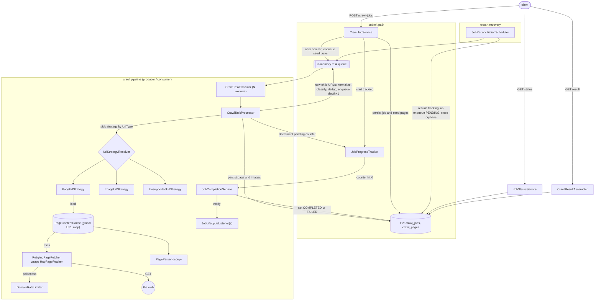

# Web Crawler

A Spring Boot implementation of the classic "image web crawler" LLD problem: accept a set of
seed URLs, crawl each page and its child pages breadth-first up to a depth limit, extract every
image URL from every page, and expose the whole thing as a nested tree through three async APIs.

No Docker, no external message broker, no external services. Persistence is an in-memory H2
database and the "task queue" is an in-process worker pool, so the whole thing runs with a
single `./gradlew bootRun`. The one non-trivial dependency is [jsoup](https://jsoup.org/) for
HTML parsing and relative-URL resolution.

See also: [`requirements.md`](requirements.md) for the functional/non-functional requirements
this was built against, [`class-diagram.md`](class-diagram.md) for a Mermaid class diagram of
how every class relates, and [`schema.md`](schema.md) for the database tables and an ER diagram.

## Contents

- [Running it](#running-it)
- [The three APIs](#the-three-apis)
- [Architecture](#architecture)
- [Design decisions & tradeoffs](#design-decisions--tradeoffs)
- [OOD walkthrough (nouns & verbs)](#ood-walkthrough-nouns--verbs)
- [Non-functional requirements](#non-functional-requirements)
- [Configuration](#configuration)
- [Project layout](#project-layout)
- [Tests](#tests)

## Running it

Requires JDK 21+ (built and tested on JDK 25) and a network connection the first time (Gradle
downloads dependencies; the crawler itself also needs network to reach real sites).

```bash
./gradlew bootRun
```

The API is then available at `http://localhost:8080`. An H2 web console is at
`http://localhost:8080/h2-console` (JDBC URL `jdbc:h2:mem:crawler`, user `sa`, empty password)
if you want to inspect `crawl_jobs` / `crawl_pages` directly.

Run the test suite (unit + full-stack integration, hermetic - no network):

```bash
./gradlew test
```

Build and run a jar:

```bash
./gradlew bootJar
java -jar build/libs/web-crawler-0.1.0.jar
```

### Deploying elsewhere

The app is a single self-contained jar with no external dependencies, so "deploy" is just "run
the jar":

- **Any VM / bare metal:** copy `build/libs/web-crawler-0.1.0.jar`, run
  `java -jar web-crawler-0.1.0.jar`. Override any setting with
  `--crawler.worker-count=16` or an env var (`CRAWLER_WORKERCOUNT=16`).
- **Container (if you want one):** a two-line Dockerfile (`FROM eclipse-temurin:25-jre`, `COPY`
  the jar, `ENTRYPOINT ["java","-jar","/app.jar"]`) is enough. No compose file is needed
  because there are no sidecar services.
- **Persistence:** the default H2 is in-memory and resets on restart. Point
  `spring.datasource.url` at a file (`jdbc:h2:file:./data/crawler`) or a real Postgres/MySQL
  (add the driver, set `spring.jpa.hibernate.ddl-auto=update`) to keep jobs across restarts -
  the reconciliation sweep will resume any job that was mid-crawl.
- **Scaling out:** see [the note in Design decisions](#design-decisions--tradeoffs) - the queue
  and the caches are per-instance today; the seams to make them shared are already interfaces.

## The three APIs

All examples assume `http://localhost:8080`.

### 1. `POST /crawl-jobs` — submit URLs for crawling

```bash
curl -s -X POST http://localhost:8080/crawl-jobs \
  -H 'Content-Type: application/json' \
  -d '{ "urls": ["https://example.com/", "https://another.example/"], "maxDepth": 2 }'
```

| Field      | Type       | Required | Notes |
|------------|------------|----------|-------|
| `urls`     | `string[]` | yes      | One or more absolute http(s) URLs. Duplicates (after normalization) are collapsed. |
| `maxDepth` | `int`      | no       | Link levels to follow. Seeds are depth 0. Defaults to `crawler.max-depth` (2). |

Returns `202 Accepted` as soon as the job and its seed pages are persisted — crawling is
asynchronous:

```json
{
  "jobId": "bf060794-cf23-4809-b947-98cc631064b6",
  "status": "RUNNING",
  "seedUrls": ["https://example.com/", "https://another.example/"],
  "maxDepth": 2
}
```

`400` if `urls` is empty or any entry is not an absolute http(s) URL.

### 2. `GET /crawl-jobs/{jobId}/status` — processing status

```bash
curl -s http://localhost:8080/crawl-jobs/bf060794-.../status
```

```json
{
  "jobId": "bf060794-...",
  "status": "RUNNING",
  "seedUrls": ["https://example.com/"],
  "maxDepth": 2,
  "discoveredPages": 42,
  "processedPages": 30,
  "failedPages": 2,
  "completionPercentage": 71.4,
  "createdAt": "2026-09-01T18:22:59.484Z",
  "startedAt": "2026-09-01T18:22:59.484Z",
  "completedAt": null,
  "error": null
}
```

`status` is the job state machine: `QUEUED → RUNNING → COMPLETED` (or `→ FAILED` if no page
could be fetched). Every count is derived from the `crawl_pages` rows on each call, so it never
disagrees with `/result`. Safe to poll. `404` for an unknown job id.

### 3. `GET /crawl-jobs/{jobId}/result` — nested image tree

```bash
curl -s http://localhost:8080/crawl-jobs/bf060794-.../result
```

Every page is a node; `imageUrls` are the images on *that* page; `children` are the pages it
linked to, recursively.

```json
{
  "jobId": "bf060794-...",
  "status": "COMPLETED",
  "totalPageCount": 4,
  "totalImageCount": 9,
  "pages": [
    {
      "url": "https://example.com/",
      "depth": 0,
      "status": "FETCHED",
      "urlType": "HTML_PAGE",
      "error": null,
      "imageUrls": ["https://example.com/logo.png"],
      "children": [
        {
          "url": "https://example.com/gallery",
          "depth": 1,
          "status": "FETCHED",
          "urlType": "HTML_PAGE",
          "error": null,
          "imageUrls": ["https://example.com/g1.jpg", "https://example.com/g2.jpg"],
          "children": [
            {
              "url": "https://cdn.example.com/full/hero.png",
              "depth": 2,
              "status": "FETCHED",
              "urlType": "IMAGE",
              "error": null,
              "imageUrls": ["https://cdn.example.com/full/hero.png"],
              "children": []
            }
          ]
        }
      ]
    }
  ]
}
```

Safe to poll while `RUNNING` — it returns the tree built so far. A page that failed to fetch
still appears, with `status: "FAILED"` and an `error` message (partial results, never a silent
gap).

## Architecture



Reading the flow:

1. **`CrawlJobService`** validates the request, normalizes + de-duplicates the seed URLs,
   persists the `CrawlJob` (`QUEUED`) and one `CrawlPage` per seed (`PENDING`), flips the job to
   `RUNNING`, and — only after the transaction commits — enqueues one task per seed.
2. **`CrawlTaskExecutor`** is a fixed pool of worker threads pulling `CrawlTask`s off an
   in-memory FIFO queue (the producer/consumer boundary).
3. **`CrawlTaskProcessor`** is the consumer body. For one task it: picks the `UrlStrategy` for
   the URL's type, runs it, persists the page + its images, and for a fetched page feeds the
   newly-discovered child URLs back into the queue at `depth + 1` (after normalize → classify →
   dedup). It is the *only* place that mutates crawl state.
4. **`UrlStrategy`** (Strategy pattern) is where URL types are handled polymorphically:
   `PageUrlStrategy` fetches + parses, `ImageUrlStrategy` records a leaf image, and
   `UnsupportedUrlStrategy` skips `mailto:` / `.pdf` / etc.
5. **`PageContentCache`** is the global "URL map": a `ConcurrentHashMap<normalizedUrl,
   ParsedPage>` shared across all jobs, so a URL fetched once is never fetched again.
6. **`JobProgressTracker`** holds, per job, the visited-URL set (dedup) and an atomic
   "pending pages" counter. When a worker takes that counter to zero, **`JobCompletionService`**
   decides the terminal state and notifies listeners.
7. **`JobReconciliationScheduler`** rebuilds all of the in-memory state from the database for
   any `RUNNING` job it doesn't recognize (i.e. after a restart) and closes out any job whose
   completion signal was lost.

## Design decisions & tradeoffs

- **Strategy pattern for URL handling.** `UrlClassifier` labels each URL `HTML_PAGE`, `IMAGE`,
  or `UNSUPPORTED` *before* any fetch; `UrlStrategyResolver` maps that to a `UrlStrategy`.
  Adding "crawl a sitemap.xml" or "follow a paginated API" is a new strategy + enum value, with
  no edit to the processor, the queue, or completion logic. Each strategy is a pure function
  `CrawlUnit → CrawlOutcome` with no access to the DB or queue, so it unit-tests in isolation.

- **Producer/consumer for parallelism.** Crawling is embarrassingly parallel, so it runs on a
  configurable fixed thread pool (`crawler.worker-count`) fed by a `BlockingQueue`, not a
  sequential loop. Shared state (`JobProgressTracker`, `PageContentCache`) is all
  `ConcurrentHashMap` / atomics — concurrent access from every worker is the normal case, not
  an edge case.

- **BFS, depth-bounded — not DFS.** The queue is FIFO and every task carries its depth; a
  page's children are only enqueued after the page is processed and never past `maxDepth`. BFS
  is the right fit here because (a) the result the API returns is a breadth-oriented "page →
  its children → their children" tree, and (b) a depth bound on BFS gives a predictable,
  bounded frontier, whereas a depth-bounded DFS would explore one branch to the limit before
  touching its siblings. The visited set makes ordering irrelevant to *correctness* — it only
  affects which parent a shared URL attaches to.

- **Completion is an atomic counter, not a guess.** The gap this design exists to avoid is
  "the loop never exits." `JobProgressTracker` keeps an `AtomicInteger` of pages still to
  process: `+1` when a page is persisted and about to be queued, `-1` when it reaches a
  terminal state — and crucially, that `-1` happens on *every* path out of
  `CrawlTaskProcessor.process`, including handled fetch failures and unexpected exceptions.
  When the counter hits zero, exactly one worker sees the transition (`decrementAndGet() == 0`)
  and triggers completion. Because a child is counted *before* its parent is decremented, the
  counter can never transiently hit zero while work remains.

- **The job state machine.** `QUEUED → RUNNING → COMPLETED | FAILED`. `FAILED` means *every*
  discovered page failed to fetch (e.g. all seeds unreachable); a job with at least one fetched
  page is `COMPLETED` even if some pages failed — those pages carry an `error` marker and the
  result is partial. Terminal state is computed from the `crawl_pages` rows and guarded so it's
  set once, whether by the last worker or the reconciliation sweep.

- **Global URL cache for scale.** The same URL routinely appears across jobs and across
  branches of one job. `PageContentCache` keys parsed results by *normalized* URL, so the
  system scales with the number of distinct URLs, not the number of (job, URL) pairs.
  `computeIfAbsent` makes "fetch-and-store" atomic per key, so two workers racing for the same
  new URL collapse onto one fetch. Failed fetches are never cached.

- **URL normalization for dedup.** `UrlNormalizer` lower-cases scheme/host, drops default
  ports, drops the `#fragment`, and trims a trailing `/` — but keeps the query string
  (`?page=2` is a different page). This canonical form is the key for the visited set, the
  `crawl_pages` unique constraint, *and* the cache, so all three agree on "same URL".

- **Retry is synchronous here (unlike a notification system).** `RetryingPageFetcher`
  (Decorator) retries *retryable* `FetchException`s (timeout, 5xx, 429) with exponential
  backoff, blocking the worker for a few hundred ms. A page fetch is a short operation, so
  blocking is acceptable and keeps the model simple; a permanent failure (4xx, bad host) is
  rethrown on the first attempt.

- **Persist-before-enqueue.** A `CrawlPage` row is always committed before its `CrawlTask` is
  queued (seeds via a post-commit hook, children via per-save commits), so a worker never
  dequeues a task for a page it can't load.

- **SRP throughout.** Scheduling (`CrawlTaskExecutor`), fetching (`HttpPageFetcher`), retry
  (`RetryingPageFetcher`), parsing (`PageParser`), classification (`UrlClassifier`),
  per-URL work (`UrlStrategy`), progress/dedup (`JobProgressTracker`), completion
  (`JobCompletionService`), and result assembly (`CrawlResultAssembler`) are each one class
  with one reason to change. `CrawlTaskProcessor` coordinates them but delegates every actual
  decision.

## OOD walkthrough (nouns & verbs)

The decomposition, done before the code:

| Noun | Class | Why it exists |
|---|---|---|
| Job | `CrawlJob` (entity) | the unit a client submits and polls; owns depth limit, timestamps, terminal state |
| Job status | `JobStatus` (enum) | the `QUEUED/RUNNING/COMPLETED/FAILED` state machine |
| URL / page | `CrawlPage` (entity) | one URL within one job; `parentPageId` models the recursive parent→child crawl structure directly |
| URL type | `UrlType` + `UrlClassifier` | so URLs are handled polymorphically |
| Crawl task | `CrawlTask` (record) | one queued unit of work |
| Result node | `PageNodeResponse` (record) | the recursive `url + imageUrls + children` structure the result API returns — mirrors `CrawlPage`'s tree |

| Verb | Class / method |
|---|---|
| assign / submit a job | `CrawlJobService.submit` |
| schedule a task | `CrawlTaskExecutor.submit` |
| run a task | `CrawlTaskProcessor.process` |
| fetch a page | `PageFetcher.fetch` (+ retry decorator) |
| parse a page | `PageParser.parse` |
| classify a URL | `UrlClassifier.classify` |
| dedup a URL | `JobProgressTracker.markDiscovered` |
| track progress | `JobProgressTracker.onPageDiscovered` / `onPageProcessed` |
| complete a job | `JobCompletionService.finalizeIfComplete` |
| assemble the result | `CrawlResultAssembler.assemble` |

Design patterns used: **Strategy** (`UrlStrategy`), **Decorator** (`RetryingPageFetcher`),
**Factory/Registry** (`UrlStrategyResolver`), **Producer/Consumer** (`CrawlTaskExecutor` +
queue + workers), **Observer** (`JobLifecycleListener`).

## Non-functional requirements

| Concern | How it's handled | Where |
|---|---|---|
| Parallelism | Fixed worker pool + blocking queue, configurable size | `CrawlTaskExecutor`, `crawler.worker-count` |
| Thread-safe shared state | `ConcurrentHashMap` / atomics for job progress, visited set, URL cache | `JobProgressTracker`, `PageContentCache` |
| Max crawl depth | Per-job `maxDepth`; children past it are not enqueued | `CrawlTaskProcessor.scheduleChildren` |
| Max pages per job | Hard cap on unique URLs discovered | `crawler.max-pages-per-job` |
| Per-URL fetch timeout | Connect + request timeout on the `HttpClient` | `HttpPageFetcher`, `crawler.fetch.timeout-millis` |
| Retry policy | Exponential backoff, retryable failures only, bounded attempts | `RetryingPageFetcher`, `crawler.retry.*` |
| Rate limiting per domain | Minimum interval between requests to the same host | `DomainRateLimiter`, `crawler.rate-limit.*` |
| Oversized responses | Body truncated past a byte cap before parsing | `crawler.fetch.max-body-bytes` |
| Cycle / revisit protection | Per-job visited set keyed by normalized URL | `JobProgressTracker` |
| Error handling | Fetch failures become `FAILED` pages with an error marker; job still completes | `PageUrlStrategy`, `JobCompletionService` |
| Restart recovery | DB is source of truth; in-memory state rebuilt for orphaned `RUNNING` jobs | `JobReconciliationScheduler` |
| Progress reporting for async callers | `/status` completion percentage from live row counts; `/result` returns the partial tree | `JobStatusService`, `CrawlResultAssembler` |

Deliberately **out of scope** (called out so they're not mistaken for oversights):
`robots.txt` compliance (the `DomainRateLimiter` is the seam for `Crawl-delay`), JS-rendered
pages, a dead-letter queue for permanently-failed URLs (they're kept as `FAILED` pages
instead), authentication, and horizontal scale-out (queue + caches are per-instance today).

## Configuration

All tunables live in `src/main/resources/application.yml` under the `crawler` prefix:

```yaml
crawler:
  worker-count: 8                       # crawl worker pool size
  max-depth: 2                          # default link depth (seeds = depth 0)
  max-pages-per-job: 200                # hard cap on unique pages per job
  reconciliation-interval-millis: 2000  # orphaned-job sweep interval
  fetch:
    timeout-millis: 10000
    user-agent: "SimpleWebCrawler/0.1 (+https://example.invalid/bot)"
    max-body-bytes: 5000000
  retry:
    max-attempts: 3                     # per-URL fetch attempts (1 = no retry)
    initial-backoff-millis: 200
    multiplier: 2.0
    max-backoff-millis: 2000
  rate-limit:
    per-domain-min-interval-millis: 200
```

`src/test/resources/application.yml` shrinks the backoffs and intervals so the suite runs in
seconds.

## Project layout

```text
src/main/java/com/crawler/
  model/        JobStatus, PageStatus, UrlType — shared value types
  entity/       CrawlJob, CrawlPage (JPA)
  repository/   Spring Data JPA repositories
  url/          UrlNormalizer, UrlClassifier
  fetch/        PageFetcher + HttpPageFetcher + RetryingPageFetcher (decorator),
                DomainRateLimiter, PageParser (jsoup), PageContentCache (global URL map),
                FetchResult / ParsedPage / FetchException
  strategy/     UrlStrategy + PageUrlStrategy / ImageUrlStrategy / UnsupportedUrlStrategy,
                UrlStrategyResolver, CrawlUnit / CrawlOutcome
  crawl/        CrawlTask, CrawlTaskExecutor (queue + worker pool),
                CrawlTaskProcessor (consumer body), JobProgressTracker (dedup + counters),
                JobCompletionService, JobLifecycleListener + LoggingJobLifecycleListener,
                JobReconciliationScheduler
  service/      CrawlJobService (orchestrator), JobStatusService, CrawlResultAssembler
  controller/   CrawlController (the 3 endpoints)
  dto/          request/response records
  config/       CrawlerProperties, FetchConfig (fetch-pipeline wiring)
  exception/    GlobalExceptionHandler, ApiError

src/test/java/com/crawler/
  url/, fetch/, crawl/    focused unit tests
  support/StubPageFetcher in-memory fake site
  CrawlApiIntegrationTest full-stack: submit → poll → assert the tree
```

## Tests

`./gradlew test` runs both layers, with no network:

- **Unit** — `UrlNormalizerTest`, `UrlClassifierTest`, `PageParserTest`, and
  `JobProgressTrackerTest` (the last one includes a 1000-thread race proving exactly one worker
  ever observes job completion).
- **Integration** — `CrawlApiIntegrationTest` boots the full context on a random port with an
  in-memory `StubPageFetcher` fake site (wrapped by the real `RetryingPageFetcher`, so the
  retry path is exercised too) and drives the real HTTP API, using
  [Awaitility](https://github.com/awaitility/awaitility) to poll the async pipeline to a
  terminal state. It covers: the nested image tree, breadth-first child crawling, per-job URL
  dedup, the `IMAGE` strategy for image links, retry-then-succeed, all-seeds-fail → `FAILED`,
  the global cache reused across two jobs, and request validation / 404s.
```
