# Class Diagram

How the classes in `src/main/java/com/crawler` relate to one another. See
[`README.md`](README.md) for the request-level architecture walkthrough — this is the
class-level companion to it, [`schema.md`](schema.md) for the database tables the entities
produce, and [`requirements.md`](requirements.md) for the requirements each class satisfies.

## Legend

| Notation | Meaning |
|---|---|
| `Interface <\|.. Impl` | `Impl` implements `Interface` |
| `Parent <\|-- Child` | `Child` extends `Parent` |
| `A o-- B` | `A` holds a reference to `B` (aggregation) |
| `A *-- B` | `A` owns `B`'s lifecycle (composition) |
| `A ..> B : verb` | `A` depends on / calls / creates `B` |

## Diagram

```mermaid
classDiagram
    direction LR

    %% ===================== REST layer =====================
    class CrawlController {
        +create(CrawlRequest) CrawlJobCreatedResponse
        +status(String jobId) JobStatusResponse
        +result(String jobId) CrawlResultResponse
    }

    %% ===================== Service / orchestration =====================
    class CrawlJobService {
        -CrawlJobRepository jobRepository
        -CrawlPageRepository pageRepository
        -UrlNormalizer urlNormalizer
        -UrlClassifier urlClassifier
        -JobProgressTracker tracker
        -CrawlTaskExecutor taskExecutor
        +submit(CrawlRequest) CrawlJob
        +getJob(String) CrawlJob
    }
    class JobStatusService {
        +getStatus(String jobId) JobStatusResponse
    }
    class CrawlResultAssembler {
        +assemble(String jobId) CrawlResultResponse
    }

    CrawlController ..> CrawlJobService : POST delegates to
    CrawlController ..> JobStatusService : GET status
    CrawlController ..> CrawlResultAssembler : GET result
    CrawlJobService --> CrawlJobRepository
    CrawlJobService --> CrawlPageRepository
    CrawlJobService --> UrlNormalizer
    CrawlJobService --> UrlClassifier
    CrawlJobService --> JobProgressTracker : start tracking
    CrawlJobService --> CrawlTaskExecutor : enqueue seed tasks after commit
    JobStatusService --> CrawlJobRepository
    JobStatusService --> CrawlPageRepository : derives counts
    CrawlResultAssembler --> CrawlJobRepository
    CrawlResultAssembler --> CrawlPageRepository : builds tree from parentPageId

    %% ===================== Domain entities + value types =====================
    class CrawlJob {
        +String id
        +JobStatus status
        +Set~String~ seedUrls
        +int maxDepth
        +int maxPages
        +Instant createdAt
        +Instant startedAt
        +Instant completedAt
        +String error
    }
    class CrawlPage {
        +Long id
        +Long version
        +String jobId
        +Long parentPageId
        +String url
        +String normalizedUrl
        +int depth
        +UrlType urlType
        +PageStatus status
        +String error
        +List~String~ imageUrls
        +Instant fetchedAt
    }
    class JobStatus {
        <<enumeration>>
        QUEUED
        RUNNING
        COMPLETED
        FAILED
    }
    class PageStatus {
        <<enumeration>>
        PENDING
        FETCHED
        FAILED
        SKIPPED
    }
    class UrlType {
        <<enumeration>>
        HTML_PAGE
        IMAGE
        UNSUPPORTED
    }

    CrawlJob --> JobStatus
    CrawlPage --> PageStatus
    CrawlPage --> UrlType
    CrawlJob "1" *-- "many" CrawlPage : jobId (fan-out)
    CrawlPage "1" o-- "many" CrawlPage : parentPageId (crawl tree)

    %% ===================== URL utilities =====================
    class UrlNormalizer {
        +normalize(String) String
    }
    class UrlClassifier {
        +classify(String normalizedUrl) UrlType
    }
    UrlClassifier ..> UrlType : produces

    %% ===================== Strategy pattern =====================
    class UrlStrategy {
        <<interface>>
        +handles() UrlType
        +process(CrawlUnit) CrawlOutcome
    }
    class PageUrlStrategy {
        -PageContentCache pageContentCache
        +process(CrawlUnit) CrawlOutcome
    }
    class ImageUrlStrategy {
        +process(CrawlUnit) CrawlOutcome
    }
    class UnsupportedUrlStrategy {
        +process(CrawlUnit) CrawlOutcome
    }
    class UrlStrategyResolver {
        -Map~UrlType,UrlStrategy~ strategies
        +resolve(UrlType) UrlStrategy
    }
    class CrawlUnit {
        +String jobId
        +long pageId
        +String url
        +String normalizedUrl
        +UrlType urlType
        +int depth
    }
    class CrawlOutcome {
        +PageStatus status
        +List~String~ imageUrls
        +List~String~ childUrls
        +String error
    }

    UrlStrategy <|.. PageUrlStrategy
    UrlStrategy <|.. ImageUrlStrategy
    UrlStrategy <|.. UnsupportedUrlStrategy
    UrlStrategyResolver o-- UrlStrategy : one per UrlType
    UrlStrategy ..> CrawlUnit : consumes
    UrlStrategy ..> CrawlOutcome : returns
    PageUrlStrategy --> PageContentCache

    %% ===================== Fetch pipeline (Decorator) =====================
    class PageFetcher {
        <<interface>>
        +fetch(String url) FetchResult
    }
    class HttpPageFetcher {
        -HttpClient httpClient
        -DomainRateLimiter rateLimiter
        +fetch(String url) FetchResult
    }
    class RetryingPageFetcher {
        -PageFetcher delegate
        -int maxAttempts
        +fetch(String url) FetchResult
    }
    class DomainRateLimiter {
        -Map~String,Object~ hostLocks
        +acquire(String host)
    }
    class PageParser {
        +parse(String baseUrl, String html) ParsedPage
    }
    class PageContentCache {
        -Map~String,ParsedPage~ cache
        -PageFetcher pageFetcher
        -PageParser pageParser
        +load(String normalizedUrl) ParsedPage
    }
    class FetchResult {
        +int statusCode
        +String contentType
        +String body
    }
    class ParsedPage {
        +List~String~ imageUrls
        +List~String~ linkUrls
    }
    class FetchException {
        +boolean retryable
    }
    class FetchConfig {
        +pageFetcher(CrawlerProperties, DomainRateLimiter) PageFetcher
    }

    PageFetcher <|.. HttpPageFetcher
    PageFetcher <|.. RetryingPageFetcher
    RetryingPageFetcher o-- PageFetcher : wraps (delegate)
    HttpPageFetcher --> DomainRateLimiter : politeness gate
    HttpPageFetcher ..> FetchResult : returns
    HttpPageFetcher ..> FetchException : throws
    PageContentCache o-- PageFetcher
    PageContentCache o-- PageParser
    PageContentCache ..> ParsedPage : caches by normalized URL
    PageParser ..> ParsedPage : produces
    FetchConfig ..> RetryingPageFetcher : composes RetryingPageFetcher(HttpPageFetcher)

    %% ===================== Producer / consumer pipeline =====================
    class CrawlTask {
        +String jobId
        +long pageId
        +String url
        +String normalizedUrl
        +UrlType urlType
        +int depth
    }
    class CrawlTaskExecutor {
        -BlockingQueue~CrawlTask~ queue
        -CrawlTaskProcessor processor
        -int workerCount
        +submit(CrawlTask)
    }
    class CrawlTaskProcessor {
        -CrawlPageRepository pageRepository
        -CrawlJobRepository jobRepository
        -UrlStrategyResolver strategyResolver
        -UrlNormalizer urlNormalizer
        -UrlClassifier urlClassifier
        -JobProgressTracker tracker
        -JobCompletionService completionService
        -CrawlTaskExecutor taskExecutor
        +process(CrawlTask)
    }
    class JobProgressTracker {
        -Map~String,JobState~ states
        +startTracking(String)
        +markDiscovered(String, String) boolean
        +discoveredCount(String) int
        +onPageDiscovered(String)
        +onPageProcessed(String) boolean
        +stopTracking(String)
    }
    class JobCompletionService {
        -CrawlJobRepository jobRepository
        -CrawlPageRepository pageRepository
        -JobProgressTracker tracker
        -List~JobLifecycleListener~ listeners
        +finalizeIfComplete(String jobId)
    }
    class JobLifecycleListener {
        <<interface>>
        +onStateChange(String jobId, JobStatus from, JobStatus to)
    }
    class LoggingJobLifecycleListener {
        +onStateChange(String, JobStatus, JobStatus)
    }
    class JobReconciliationScheduler {
        +reconcile()
    }

    CrawlTaskExecutor o-- CrawlTaskProcessor : hands each task (lazy, breaks cycle)
    CrawlTaskExecutor *-- CrawlTask : queues
    CrawlTaskProcessor --> UrlStrategyResolver : pick strategy by type
    CrawlTaskProcessor --> UrlNormalizer
    CrawlTaskProcessor --> UrlClassifier
    CrawlTaskProcessor --> CrawlPageRepository
    CrawlTaskProcessor --> CrawlJobRepository
    CrawlTaskProcessor --> JobProgressTracker : dedup + counters
    CrawlTaskProcessor --> CrawlTaskExecutor : enqueue children depth+1
    CrawlTaskProcessor --> JobCompletionService : when counter hits 0
    JobCompletionService --> CrawlJobRepository
    JobCompletionService --> CrawlPageRepository
    JobCompletionService --> JobProgressTracker : stop tracking
    JobCompletionService o-- JobLifecycleListener : notifies (Observer)
    JobLifecycleListener <|.. LoggingJobLifecycleListener
    JobReconciliationScheduler --> CrawlJobRepository : finds orphaned RUNNING jobs
    JobReconciliationScheduler --> CrawlPageRepository
    JobReconciliationScheduler --> JobProgressTracker : rebuilds lost state
    JobReconciliationScheduler --> CrawlTaskExecutor : re-enqueues PENDING pages
    JobReconciliationScheduler --> JobCompletionService : closes orphans

    %% ===================== Repositories =====================
    class CrawlJobRepository {
        <<interface>>
        +findByStatus(JobStatus) List~CrawlJob~
    }
    class CrawlPageRepository {
        <<interface>>
        +findByJobId(String) List~CrawlPage~
        +findByJobIdAndStatus(String, PageStatus) List~CrawlPage~
        +countByJobId(String) long
        +countByJobIdAndStatus(String, PageStatus) long
    }
    CrawlJobRepository ..> CrawlJob
    CrawlPageRepository ..> CrawlPage
```



## Reading this alongside the design

- **Strategy** — `UrlStrategy` has three implementations selected by `UrlType`.
  `UrlStrategyResolver` is the registry that maps type → strategy, built from every
  `UrlStrategy` bean at startup. `CrawlTaskProcessor` never switches on type itself.
- **Decorator** — `RetryingPageFetcher` both implements and wraps `PageFetcher`, so
  `PageContentCache` calls one `PageFetcher` and gets retry-with-backoff transparently.
  `FetchConfig` is the only place the two are composed.
- **Producer / Consumer** — `CrawlTaskExecutor` is the queue plus the worker pool;
  `CrawlJobService` and `CrawlTaskProcessor` are the producers, `CrawlTaskProcessor` is also
  the consumer body.
- **Observer** — `JobLifecycleListener` is notified on every job state transition;
  `LoggingJobLifecycleListener` is the one built-in listener, and a webhook/metric listener
  would just be another bean.
- **The one deliberate cycle** — `CrawlTaskExecutor → CrawlTaskProcessor → CrawlTaskExecutor`
  (the processor enqueues discovered children). It is broken with `@Lazy` on the executor's
  reference to the processor rather than restructured away, since the only alternative is an
  interface that exists purely to dodge the cycle.
- **`CrawlPage` is self-referential** — `parentPageId` points at another `CrawlPage`, which is
  exactly the nested tree `CrawlResultAssembler` rebuilds and `/result` returns.
```
