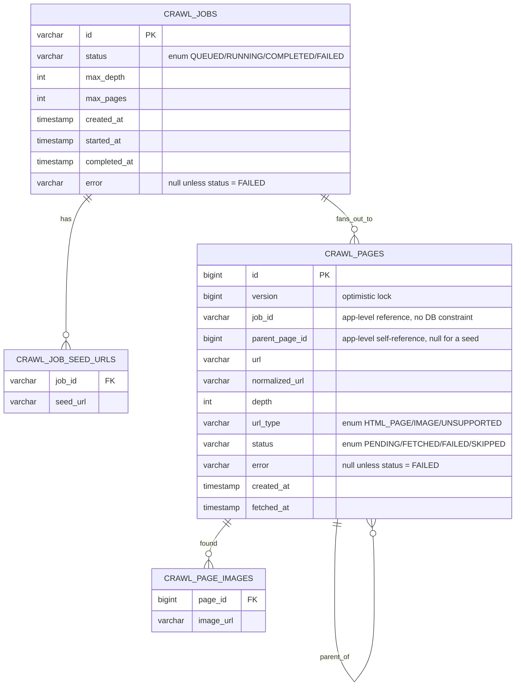

# Database Schema

There is no migration tool and no hand-written `schema.sql` — every table below is generated on
each start by Hibernate (`spring.jpa.hibernate.ddl-auto: create-drop`) directly from the
`@Entity` classes in `com.crawler.entity`. This document is the schema those two classes
(`CrawlJob`, `CrawlPage`) produce; see [`class-diagram.md`](class-diagram.md) for how the entity
classes relate to the rest of the code, [`README.md`](README.md#the-three-apis) for the API
that reads and writes them, and [`requirements.md`](requirements.md) for the requirements
behind each table.

## Contents

- [Entity-relationship diagram](#entity-relationship-diagram)
- [Tables](#tables)
- [Design notes](#design-notes)
- [Worked example: rows created by one crawl](#worked-example-rows-created-by-one-crawl)
- [Regenerating this document](#regenerating-this-document)

## Entity-relationship diagram



`fans_out_to` and `parent_of` are drawn for readability but are **not** real foreign keys —
`job_id` and `parent_page_id` are plain columns (see [Design notes](#design-notes)). Only the
two element-collection tables (`_SEED_URLS`, `_PAGE_IMAGES`) have a DB-level `FOREIGN KEY`.

## Tables

### `crawl_jobs`

Backs the `CrawlJob` entity — one row per `POST /crawl-jobs` request.

| Column | Type | Nullable | Notes |
|---|---|---|---|
| `id` | `varchar(255)` | No | **Primary key.** App-assigned UUID string (`UUID.randomUUID()`). |
| `status` | `enum('COMPLETED','FAILED','QUEUED','RUNNING')` | No | The job state machine. Native H2 enum, backed by `JobStatus`. |
| `max_depth` | `integer` | No | Link levels to follow; seeds are depth 0. |
| `max_pages` | `integer` | No | Hard cap on unique pages for this job (from `crawler.max-pages-per-job` at submit time). |
| `created_at` | `timestamp(6) with time zone` | No | |
| `started_at` | `timestamp(6) with time zone` | Yes | Set when the job flips `QUEUED → RUNNING` (same request, right after persist). |
| `completed_at` | `timestamp(6) with time zone` | Yes | Set when the job reaches `COMPLETED` / `FAILED`. |
| `error` | `varchar(2000)` | Yes | Populated only for `status = FAILED`. |

There is **no progress counter column** — `discoveredPages` / `processedPages` / `failedPages`
in the status response are counted from `crawl_pages` on every read.

### `crawl_job_seed_urls`

Element-collection table backing `CrawlJob.seedUrls` (`Set<String>`). Not a standalone entity.

| Column | Type | Nullable | Notes |
|---|---|---|---|
| `job_id` | `varchar(255)` | No | **FK** → `crawl_jobs.id`, DB-enforced (`FKr6s3gorknwo2omxw7fgqhagh8`). |
| `seed_url` | `varchar(2000)` | Yes | One seed URL, in the raw form the client sent (after `trim()`). |

The de-duplicated *normalized* seeds live in `crawl_pages` (depth 0); this table keeps the
original strings for display in the status response.

### `crawl_pages`

Backs the `CrawlPage` entity — one row per unique URL discovered for a job. The tree is formed
by `parent_page_id`. The most heavily-accessed table in the system.

| Column | Type | Nullable | Notes |
|---|---|---|---|
| `id` | `bigint` | No | **Primary key.** DB-generated (`generated by default as identity`). This is the `pageId` on a `CrawlTask`. |
| `version` | `bigint` | Yes | JPA optimistic-lock version. Guards against two workers ever processing the same page row. |
| `job_id` | `varchar(255)` | No | References `crawl_jobs.id` **at the application level only**. |
| `parent_page_id` | `bigint` | Yes | `null` for a seed page; otherwise the `crawl_pages.id` whose HTML first linked to this URL. App-level self-reference, no DB constraint. |
| `url` | `varchar(2000)` | No | The URL as discovered (relative links already resolved against the parent by jsoup). |
| `normalized_url` | `varchar(2000)` | No | Canonical form (`UrlNormalizer`) — the dedup key. |
| `depth` | `integer` | No | 0 for a seed; parent's depth + 1 otherwise. |
| `url_type` | `enum('HTML_PAGE','IMAGE','UNSUPPORTED')` | No | Set by `UrlClassifier` before fetching. Backed by `UrlType`. |
| `status` | `enum('FAILED','FETCHED','PENDING','SKIPPED')` | No | Page lifecycle. Backed by `PageStatus`. Part of `idx_page_job_status`. |
| `error` | `varchar(2000)` | Yes | Populated only for `status = FAILED` (the fetch error message — partial result marker). |
| `created_at` | `timestamp(6) with time zone` | No | |
| `fetched_at` | `timestamp(6) with time zone` | Yes | Set when the page reaches a terminal state. |

**Constraints / indexes:**

- `idx_page_job_normalized_url` — **unique** `(job_id, normalized_url)`. Enforces "one page per
  URL per job" at the database level, backing up the in-memory visited set.
- `idx_page_job_status` — index on `(job_id, status)`. This is what `JobCompletionService` and
  `JobReconciliationScheduler` scan by ("any PENDING pages left for this job?").

### `crawl_page_images`

Element-collection table backing `CrawlPage.imageUrls` (`List<String>`) — the image URLs found
on that one page.

| Column | Type | Nullable | Notes |
|---|---|---|---|
| `page_id` | `bigint` | No | **FK** → `crawl_pages.id`, DB-enforced (`FK2hgbh2rnqn6cusv836s4ek2yi`). |
| `image_url` | `varchar(2000)` | Yes | One absolute image URL. |

## Design notes

- **Job progress is never stored, always derived.** No `status`-count columns on `crawl_jobs`;
  `JobStatusService` runs `countByJobId` / `countByJobIdAndStatus` on each `/status` call, so
  the numbers can never drift from the `crawl_pages` rows that `/result` walks. The in-memory
  `JobProgressTracker` counter is a hot-path optimisation for *detecting* completion, not a
  second source of truth — it is rebuilt from this table after a restart.
- **Cross-entity references are plain columns, not JPA relationships, by design.** `job_id` and
  `parent_page_id` on `crawl_pages` are ordinary columns, not `@ManyToOne` associations, so
  there is no DB `FOREIGN KEY` on them (confirmed in the generated DDL: only the two
  element-collection tables get an `alter table ... add constraint FK...`). The crawl writes
  pages by their own `id` and reads them in bulk by `job_id`; a mapped association would invite
  N+1 fetches for a graph nothing navigates object-by-object. `CrawlResultAssembler` rebuilds
  the tree in memory with a single `findByJobId` + a `parentPageId` group-by.
- **The tree is self-referential in one table**, not a separate edge table — `parent_page_id`
  is enough because the crawl already guarantees each URL appears once per job (the unique
  constraint), so every page has exactly one parent.
- **Enum columns are native H2 `ENUM` types**, via `@Enumerated(EnumType.STRING)` —
  `status` / `url_type` / job `status` are constrained to their enum values at the database
  level, not free text.
- **Two primary-key strategies.** `crawl_jobs.id` is an app-assigned UUID string (known before
  the row is inserted, so the seed tasks can be built in the same method). `crawl_pages.id` is
  a DB `IDENTITY` long, since nothing needs a page's id before it is saved.
- **`version` enables safe re-dispatch.** The reconciliation sweep can re-enqueue a `PENDING`
  page; if that ever races with a still-running original attempt, the optimistic-lock version
  makes the second `save` fail rather than double-processing the page.

## Worked example: rows created by one crawl

```http
POST /crawl-jobs
{ "urls": ["https://example.com/"], "maxDepth": 1 }
```

where `https://example.com/` has `` and one link to `/about`, and
`/about` has `` and a link back to `/`:

| Table | Rows written |
|---|---|
| `crawl_jobs` | 1: `id=J1, status=RUNNING→COMPLETED, max_depth=1` |
| `crawl_job_seed_urls` | 1: `(job_id=J1, seed_url=https://example.com/)` |
| `crawl_pages` | 2: `id=P1, job_id=J1, parent_page_id=null, url=https://example.com/, depth=0, status=FETCHED` and `id=P2, parent_page_id=P1, url=https://example.com/about, depth=1, status=FETCHED` |
| `crawl_page_images` | 2: `(page_id=P1, image_url=https://example.com/logo.png)` and `(page_id=P2, image_url=https://example.com/team.jpg)` |

The link from `/about` back to `/` is **not** a new row — `https://example.com/` is already in
`crawl_pages` for `J1` (unique `(job_id, normalized_url)`), so it is deduplicated. If `/about`
had failed to fetch, `P2` would be `status=FAILED` with an `error` message and `J1` would still
be `COMPLETED` (P1 succeeded).

## Regenerating this document

The DDL above was captured from Hibernate, not hand-written:

```bash
./gradlew bootJar
java -jar build/libs/web-crawler-0.1.0.jar \
  --spring.main.web-application-type=none \
  --spring.jpa.properties.jakarta.persistence.schema-generation.scripts.action=create \
  --spring.jpa.properties.jakarta.persistence.schema-generation.scripts.create-target=/tmp/schema.sql
# Ctrl-C once started, then read /tmp/schema.sql
```
